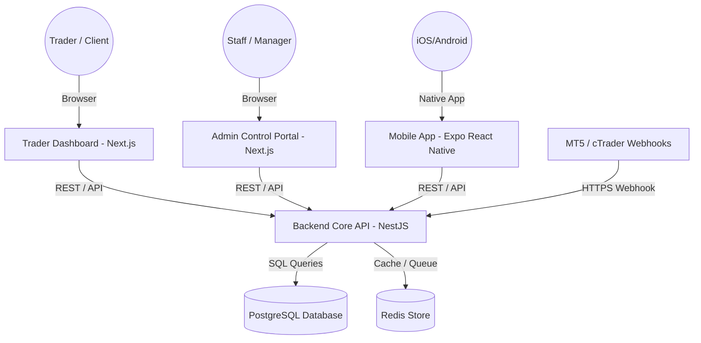

# FundOS - Handover & Production Launch Guide

Welcome to the official handover and production rollout documentation for **FundOS**, the enterprise-grade Operating System for Proprietary Trading Firms. This document serves as a comprehensive reference guide for system administrators, operations teams, and maintainers.

---

## 1. System Architecture Summary

FundOS is structured as a modern Monorepo managed by **PNPM Workspaces** and accelerated by **Turborepo** for build caching and pipeline execution.



### Monorepo Components Directory
*   [`apps/backend-api`](file:///c:/Users/Joshua/Desktop/My%20Projects/Websites/FundOS/apps/backend-api): Core NestJS REST API engine handling auth, wallets, risk evaluation, challenge checkouts, integrations, and performance coaching.
*   [`apps/trader-dashboard`](file:///c:/Users/Joshua/Desktop/My%20Projects/Websites/FundOS/apps/trader-dashboard): Premium Next.js application exposing stats trackers, equity curves, active rules drawers, and wallet checkout cards for traders.
*   [`apps/admin-dashboard`](file:///c:/Users/Joshua/Desktop/My%20Projects/Websites/FundOS/apps/admin-dashboard): Advanced Next.js operations portal for managing challenge presets, approving payout requests, and reviewing risk audit logs.
*   [`apps/mobile-app`](file:///c:/Users/Joshua/Desktop/My%20Projects/Websites/FundOS/apps/mobile-app): Expo React Native application offering home compliance checkups, secure token storages, biometrics locks, and explore chat feeds.
*   [`packages/ui`](file:///c:/Users/Joshua/Desktop/My%20Projects/Websites/FundOS/packages/ui): Shareable Vanilla CSS design system library containing buttons, cards, inputs, and common interfaces.
*   [`packages/typescript-config`](file:///c:/Users/Joshua/Desktop/My%20Projects/Websites/FundOS/packages/typescript-config): Centralized tsconfig configurations.

---

## 2. Production Installation & Run Instructions

### Option A: Containerized Deployment (Recommended)
This approach deploys all containers (databases, caches, api servers, and client dashboards) automatically.

1.  **Configure environment variables**:
    ```bash
    cp .env.prod.example .env
    # Edit .env with your production secrets (JWT_SECRET, database passwords, Stripe keys)
    ```
2.  **Execute the automated deployment script**:
    ```bash
    chmod +x scripts/deploy.sh
    ./scripts/deploy.sh
    ```
    This script automatically checks your configuration, starts PostgreSQL & Redis, applies Prisma database migrations, runs seed procedures, builds Docker containers, and launches all services.

### Option B: Bare-Metal / VM Deployment (PM2)
To run FundOS directly on virtual machines (e.g. AWS EC2, DigitalOcean Droplet):

1.  **Install dependencies and build assets**:
    ```bash
    pnpm install --frozen-lockfile
    pnpm build
    ```
2.  **Apply database migrations**:
    ```bash
    pnpm --filter backend-api run prisma migrate deploy
    pnpm --filter backend-api run prisma db seed
    ```
3.  **Launch process manager cluster**:
    ```bash
    pm2 start ecosystem.config.js
    ```

---

## 3. Database Administration & Migrations

FundOS uses **Prisma ORM** mapped to PostgreSQL. The schema has soft-delete interceptors and multi-tenant isolation layers configured at the Prisma Service middleware level.

### Standard Operations Commands
*   **Generate local TypeScript bindings**:
    ```bash
    pnpm --filter backend-api run prisma generate
    ```
*   **Run migrations locally during development**:
    ```bash
    pnpm --filter backend-api run prisma migrate dev --name <migration_name>
    ```
*   **Deploy migrations on production database**:
    ```bash
    pnpm --filter backend-api run prisma migrate deploy
    ```
*   **Reset database schema (CAUTION: Destructive)**:
    ```bash
    pnpm --filter backend-api run prisma migrate reset
    ```

---

## 4. API Endpoints Reference Map

| Module | Method | Route | Authentication | Description |
| :--- | :--- | :--- | :--- | :--- |
| **Auth** | `POST` | `/auth/register` | None | Sign up a new trader and provision default USD wallet. |
| | `POST` | `/auth/login` | None | Authenticate user, verify 2FA codes, and return JWT tokens. |
| **Tenant** | `GET` | `/tenant/branding` | None | Resolve dynamic styling colors and company name by subdomain headers. |
| | `PATCH`| `/tenant/branding` | Admin | Update organization theme configs (colors, logo URLs). |
| **Challenge**| `GET` | `/challenges` | Trader | Fetch all active challenge presets offered by the organization. |
| | `POST` | `/challenges/:id/purchase` | Trader | Purchase a challenge. Provisions broker account credentials. |
| **Broker** | `POST` | `/integrations/webhooks/:provider` | None (Token) | Receives webhook trades from MT5, cTrader, and DXTrade. |
| **Risk** | `POST` | `/risk/accounts/:id/check` | Trader | Perform audits checking hedging, volume spikes, and revenge trades. |
| **Payments**| `POST` | `/payments/payout-requests` | Trader | Request a profit withdrawal. Locks the requested USD wallet funds. |
| | `POST` | `/payments/payout-requests/:id/approve` | Admin | Approve a payout and release the locked funds. |

---

## 5. Production Launch & Hardening Checklist

- [ ] **SSL/TLS Certificates**: Route all traffic through HTTPS (using Nginx reverse proxy, Cloudflare, or AWS ALB).
- [ ] **Secure Passwords & Keys**: Override default postgres database passwords and generate secure base64 keys for `JWT_SECRET`.
- [ ] **Stripe Webhooks Configuration**: Register the backend API webhook endpoint (`https://api.yourdomain.com/api/v1/payments/webhook`) in Stripe Dashboard and configure `STRIPE_WEBHOOK_SECRET`.
- [ ] **Rate Limiting**: Enforce API rate-limiting configurations on Nginx or cloud load balancers.
- [ ] **Prisma Middleware Audits**: Verify that `PrismaService` soft-delete rules are mapping correctly in the production environment.
- [ ] **Database Backups**: Schedule automated nightly cron backups for the PostgreSQL volumes.

---

## 6. Maintenance & Backup Guidelines

### Database Backup Script
To take a raw snapshot of the PostgreSQL database, configure this script as a cron job:
```bash
#!/bin/bash
BACKUP_DIR="/var/backups/postgres"
DATE=$(date +%Y-%m-%d_%H%M%S)
docker exec fundos-postgres-prod pg_dump -U fundos_admin fundos_db > $BACKUP_DIR/fundos_db_$DATE.sql
# Keep only the last 30 days of backups
find $BACKUP_DIR -type f -mtime +30 -name "*.sql" -delete
```

### Troubleshooting & Logs
*   **Docker Container logs**:
    ```bash
    docker-compose -f docker-compose.prod.yml logs -f --tail=100 [container_name]
    ```
*   **PM2 process logs**:
    ```bash
    pm2 logs --lines 100
    ```
